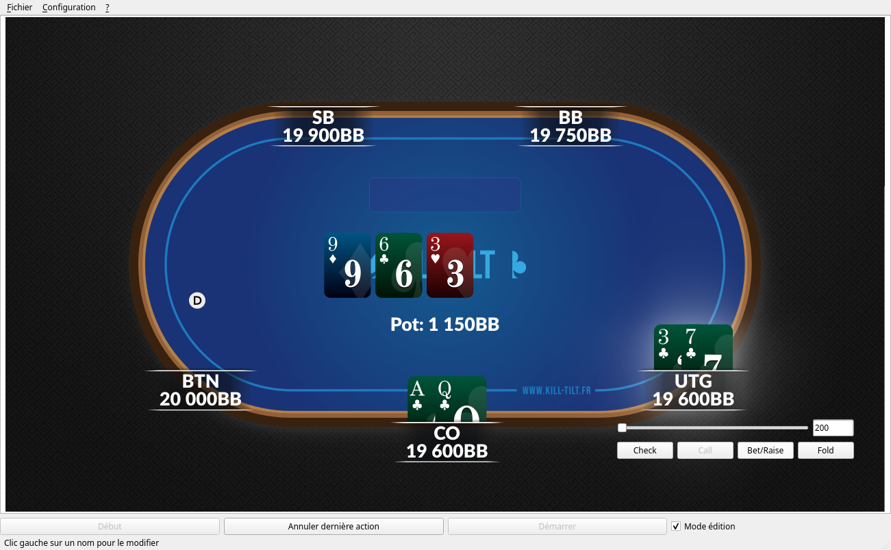

# Poker hand history creator

hh-creator is a [PyQt5](https://riverbankcomputing.com/software/pyqt/download5)-based
application to create Texas and Omaha Hold'em poker hand histories from scratch,
including a nice looking hand replayer.
Its main use is to make educational poker videos but it can also be used to store
interesting hands that were played live.

It was developed for the French online poker web community
[Kill-Tilt](https://www.kill-tilt.fr/).

# License

You are free to use, modify and distribute this software.

If you modify it so that the Kill Tilt logo does not appear anywhere and publish work
made with it, please cite Kill Tilt somewhere.
A simple thank you in your website/video is OK.
We have no way to force you to do this, but it would make you a decent human being, and
being a decent human being is a good thing.

The source code is released under the
[GPLv3 license](https://www.gnu.org/licenses/gpl-3.0.html).

The graphics were made by [Julien Escalas](http://www.julienescalas.fr/) and are
released under the [Creative Commons 
Attribution-ShareAlike license](https://creativecommons.org/licenses/by-sa/4.0/).

The [Lato fonts](https://www.latofonts.com/) are under the
[SIL Open Font License](https://scripts.sil.org/cms/scripts/page.php?item_id=OFL_web)

The sounds were bought on [audiojungle](https://audiojungle.net/) with the
[SFX multi-use licence](https://audiojungle.net/licenses/terms/audio_sfx_media_multi).